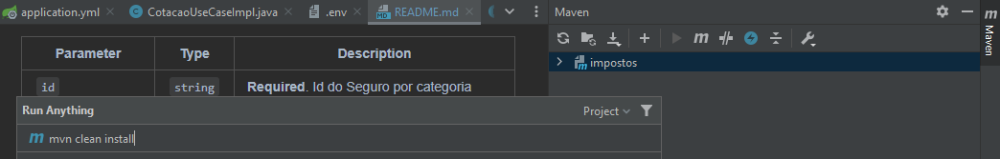
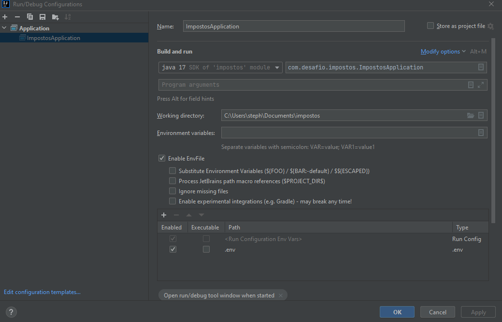
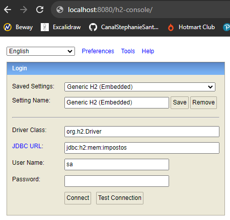

# Api de imposto

Aplicação que realiza calculo de tarifas para produtos de seguro com base no valor informado e categoria.


## API Reference

#### Calcula tarifa produto de seguro por categoria

```http
  POST localhost:8080/seguros/cotacao
```

Request Body:

| Parameter | Type     | Description                |
| :-------- | :------- | :------------------------- |
| `nome` | `string` | **Required**. Nome do Seguro |
| `categoria` | `string` | **Required**. Nome da Categoria |
| `preco_base` | `double` | **Required**. Preço base do seguro |

Response Body: [201]

| Parameter | Type     | Description                |
| :-------- | :------- | :------------------------- |
| `id` | `string` | **Required**. Id do Seguro por categoria |
| `nome` | `string` | **Required**. Nome do Seguro |
| `categoria` | `string` | **Required**. Categoria do Seguro |
| `preco_base` | `double` | **Required**. Preco base do seguro |
| `preco_tarifado` | `double` | **Required**. Preco tarifado com base no calculo do preco base e categoria |

## Pré requisitos para executar a aplicação local

* JDK 17
* Maven 3.8.6
    * Add maven no pom e executar o comando `mvn clean install` no terminal da aplicação ou direto no console do maven localizado do lado direito superior
    

## Environment Variables

Para executar este projeto, você precisará instalar plugin EnvFile e apontar o arquivo .env nas configurações da sua aplication para que a aplicação consiga ler as variaveis e executar a aplicação com sucesso :)


## Curl para executar aplicação local via Insomnia ou Postman

```
curl --request POST \
  --url http://localhost:8080/seguros/cotacao \
  --header 'Content-Type: application/json' \
  --data '{
	"nome": "Seguro de Vida Individual",
	"categoria": "AUTO",
	"preco_base": 55.00
}'
```

#### Acessar tabela h2 console

```
http://localhost:8080/h2-console/
```


## Detalhes técnicos da solução

Esta aplicação tem como premissa o cálculo de tarifas de seguro com base no preço base e na categoria. O desafio consistiu em criar uma API REST que executasse essa premissa mencionada anteriormente.

Na implementação, decidi utilizar apenas um endpoint POST que realiza a cotação do seguro. Caso a categoria já exista, o código irá realizar a atualização dos dados com base no valor informado e na tarifa calculada.

Como a aplicação gera a tarifa conforme a categoria, optei por utilizar o design pattern Strategy Factory. Com esse design, consigo adicionar uma implementação para cada produto, evitando o uso de diversos "ifs" e "elses" para tomada de decisão. Além disso, respeito o princípio do SOLID, especificamente o Princípio da Responsabilidade Única, que deixa a responsabilidade de cálculo para cada classe de serviço, de acordo com sua categoria, e o Princípio de Aberto/Fechado, que permite a extensão sem a necessidade de alteração. A funcionalidade basicamente verifica a categoria e chama a implementação correta.

Decidi utilizar a abstração de camadas e interfaces para abstrair as regras de negócios e designar responsabilidades para classes específicas, utilizando alguns dos pilares do SOLID, como o Princípio da Responsabilidade Única, Princípio da Segregação de Interfaces e Princípio da Inversão de Dependência. Isso tornou o código mais coeso, limpo e organizado.

Resolvi criar variáveis de ambiente para evitar valores fixos no código, caso os valores das taxas mudem. Isso facilita a alteração dos valores, sendo necessário apenas a troca das variáveis de ambiente, em vez de realizar um novo deploy da aplicação para fazer ajustes.

Optei por usar a arquitetura Clean Architecture, pois aprecio seu objetivo de separar a aplicação por camadas e módulos. Isso permite desacoplar o núcleo, a aplicação e o banco de dados/infraestrutura, tornando mais fácil a substituição do banco ou de alguma tecnologia, se necessário.

Utilizei o H2 e criei um arquivo para popular o banco de dados durante a execução da aplicação. Também incluí logs ao longo da execução para rastrear as solicitações com maior facilidade. Caso ocorra algum erro, isso facilita a localização e a resolução do problema, além de ajudar na criação de painéis de acompanhamento.

Quanto aos testes, foram realizados testes unitários com JUnit e testes de integração para testar a execução de ponta a ponta com o banco de dados. Optei por criar uma tabela de testes para não poluir a tabela da aplicação principal.

